```{r setup, include=FALSE}
options(htmltools.dir.version = FALSE)
knitr::opts_chunk$set(
  fig.width=9, fig.height=3.5, fig.retina=3,
  out.width = "100%",
  cache = FALSE,
  echo = TRUE,
  message = FALSE, 
  warning = FALSE,
  hiline = TRUE
)
```

```{r xaringan-themer, include=FALSE, warning=FALSE}
library(xaringanthemer)

extra_css = list(
  ".red" = list(color = "red"),
  ".orange" = list(color = "orange"),
  ".chocolate" = list(color = "chocolate"),
  ".too_large" = list("font-size" = "200%"),
  ".very_large" = list("font-size" = "150%"),
  ".large" = list("font-size" = "120%"),
  ".small" = list("font-size" = "80%"),
  ".very_small" = list("font-size" = "65%"),
  ".too_small" = list("font-size" = "50%"),
  ".full-width" = list(
    display = "flex",
    width = "100%",
    flex = "1 1 auto"
  )
)

style_mono_accent(
  link_color = "chocolate",
  extra_css = extra_css,
  base_color = "#1c5253", # 全体的な配色（今回は緑ベース）
  text_font_size = "30px" # スライド本文のフォントサイズ（スライドタイトルは別）
)

```

# 紀ノ定 保礼（きのさだ やすのり）

- 所属
    + 静岡理工科大学　情報学部　講師 

- 研究領域
    + 認知心理学、社会心理学を応用して、交通行動を研究しています
    + 最近は、テクノロジー × 心理　に興味あり

---

# 本講義の構成

1. R言語の基礎

2. R Markdownによるドキュメント生成の利点

3. R Markdownによるドキュメント生成の手続き

4. R Markdownによるドキュメント生成の実習

5. 作成したドキュメントの共有
  + Open Science Framework (OSF)
  + GitHub

---

# R言語の基礎：参考資料


[森知晴先生の素晴らしい資料](https://tomoecon.github.io/R_for_graduate_thesis/)を、参考にさせていただきます。

---

# パッケージを用いない可視化

.pull-left[

ヒストグラム<br>
.very_small[車の性能に関するデータセット`mtcars`の中の、燃費`mpg`変数を用いている]

```{r hist}
hist(mtcars$mpg)
```

]

.pull-right[

散布図<br>
.very_small[車の性能に関するデータセット`mtcars`の中の、燃費`mpg`変数と、重量`wt`変数を用いている]

```{r scatter-plot}
plot(mtcars$mpg, mtcars$wt)
```

]

---

# 実習

以下の内容について、Wordを用いて、ショートレポートを書いてみましょう。<br>（分量は、A4 1枚以下でOK）

- 使用するデータ
  + `mtcars`データセット
  + レポート内容
     - 要約統計量から分かること
     - その他の統計的分析から分かること（任意）
     - 可視化から分かること
     - その他自由

---

class: inverse, center, middle

# できましたか？

---

class: inverse, middle, center

# おっとすみません、<br>使用してもらうデータを間違えました！

---

# 実習（その2）

以下の内容について、Wordを用いて、ショートレポートを書いてみましょう。<br>（分量は、A4 1枚以下でOK）

- 使用するデータ
  + `iris`データセット
  + レポート内容
     - 要約統計量から分かること
     - その他の統計的分析から分かること（任意）
     - 可視化から分かること
     - その他自由

---

class: inverse, center, middle

# 今度こそ、できましたか？

---


可視化は大事（[オリジナルサイトのリンク](http://www.thefunctionalart.com/2016/08/download-datasaurus-never-trust-summary.html)）

---

class: inverse, middle, center

# ところで、レポートを作り直すの、<br>面倒じゃなかったですか？

.footnote[いや誰のせいや思とんねん]

---

class: inverse, middle, center

# Then, you are ready to use R Markdown !

---

# おすすめ図書

.pull-left[


.very_small[立命館大学総合心理学部　高橋康介先生著！]
]

.pull-right[


.very_small[通称、「宇宙船本」]
]

---

# おすすめ図書


通称、「宇宙船本」

---

# おすすめ図書（もうええわ）


---


# おすすめWeb資料（しかも無料で閲覧可）

.pull-left[


.very_small[[リンクはこちら](https://bookdown.org/yihui/rmarkdown/)]
]

.pull-right[


.very_small[[日本語訳のリンクはこちら](https://gedevan-aleksizde.github.io/rmarkdown-cookbook/)]
]

---

### ドキュメント例

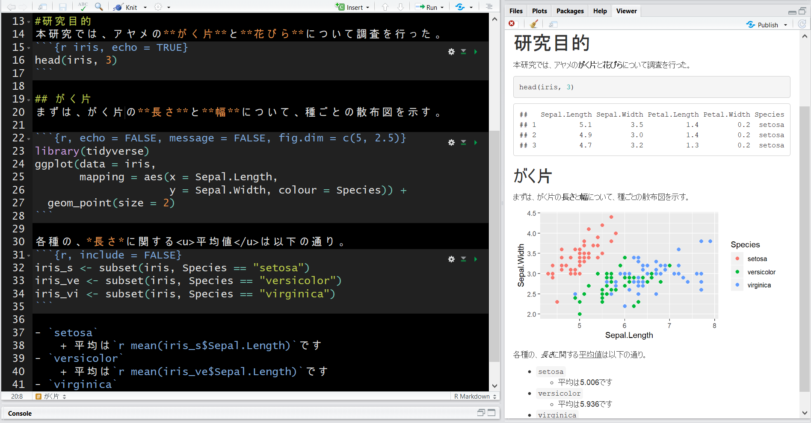

---

### Google Colaboratoryによるドキュメント例

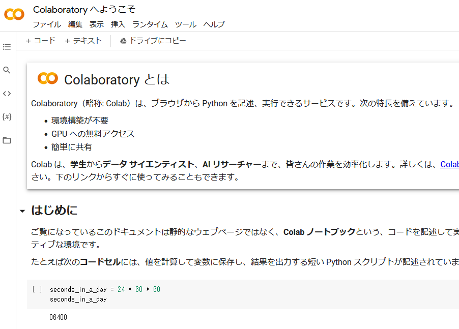

これは**notebook**と呼ばれるドキュメント

<u>[リンクはこちら](https://www.google.com/url?sa=t&rct=j&q=&esrc=s&source=web&cd=&cad=rja&uact=8&ved=2ahUKEwig9ueuwNj0AhX_hlYBHaXGARMQFnoECAMQAQ&url=https%3A%2F%2Fcolab.research.google.com%2Fnotebooks%2Fwelcome.ipynb%3Fhl%3Dja&usg=AOvVaw0qrT1c7i_vNFAUuRBp9c6M)</u>

---

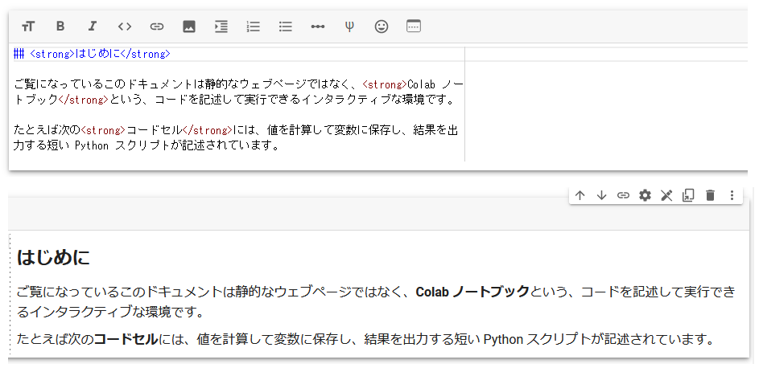

セルをダブルクリックして見てみよう<br>
　→　HTMLタグによって装飾されている

---

Markdownには色々と種類があるが、<br>
<u>R Markdownで</u>用いられているのは**Pandocの**Markdown

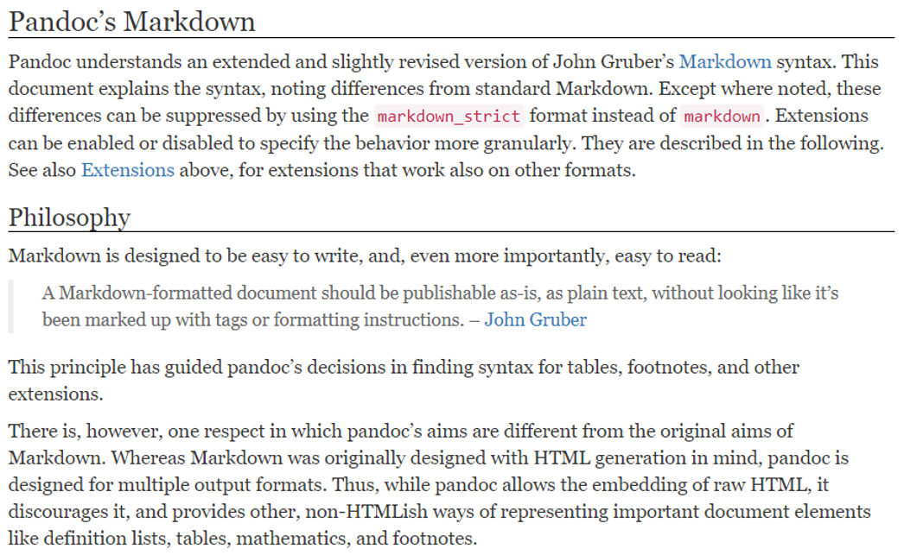

詳細は<u>[こちらから](https://pandoc.org/MANUAL.html#pandocs-markdown)</u>

---

**PandocのMarkdown**記法の例

.pull-left[
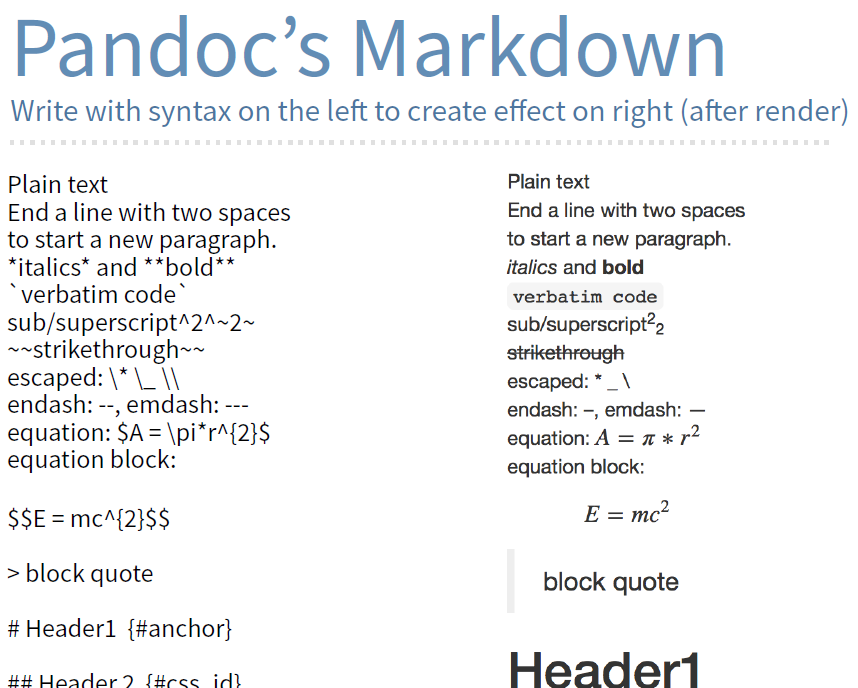
]

.pull-right[
.small[[R Markdownチートシート](https://www.rstudio.com/wp-content/uploads/2016/11/Rmarkdown-cheatsheet-2.0_ja.pdf)より
]

.small[Markdownは、**軽量マークアップ言語**<br>
　→　HTMLタグをごちゃごちゃ書かずとも、簡便的にドキュメントを作れる<br>
　　 （もちろんHTMLタグを併用してもよい）
]
]

---

_R Markdown_とは、<u>**Markdown**</u>の記法を用いて、  
R上でドキュメントを生成するシステム

- .small[*ドキュメント構造*を記述する、~~重量~~軽量マークアップ言語]

*********

.small[例えば上記の文章は、以下のような記法を使用]

```r
_R Markdown_とは、<u>**Markdown**</u>の記法を用いて、R上でドキュメントを  #←行末に半角スペース 2つ
生成するシステム

- ドキュメント構造を記述する、~~重量~~軽量マークアップ言語
```

.small[HTMLなら、記述量が増える]

```r
<i>R Markdown</i>とは、<u><b>Markdown</b></u>の記法を用いて、<br>
R上でドキュメントを生成するシステム

<ul><li>ドキュメント構造を記述する、<del>重量</del>軽量マークアップ言語</li></ul>
```

---

### Google Colaboratory上で、Markdown記法の練習

- Google Colaboratory（Python環境）を使うには、<u>[このリンクから](https://www.google.com/url?sa=t&rct=j&q=&esrc=s&source=web&cd=&cad=rja&uact=8&ved=2ahUKEwig9ueuwNj0AhX_hlYBHaXGARMQFnoECAMQAQ&url=https%3A%2F%2Fcolab.research.google.com%2Fnotebooks%2Fwelcome.ipynb%3Fhl%3Dja&usg=AOvVaw0qrT1c7i_vNFAUuRBp9c6M)</u>

- Googleアカウントでログイン済みの人は、<u>[このリンクから](https://colab.research.google.com/notebook#create=true&language=r)</u>R環境が使える
    + ただしbase Rしか使えないので注意
    + 様々なパッケージがインストールされたR環境を使うには、
        + 方法①：一手間要るが、<u>[このリンク](https://htsuda.net/stats/colab.html)</u>を参照。
        + 方法②：冒頭のセルで`%load_ext rpy2.ipython`と記述し<br>実行しておき、Rコードを実行したい各セルの1行目に`%%R`と追記する


---

## RStudio上でのドキュメント生成

.small[
1. Rmdファイルを準備
2. 文章（Markdown記法で）や、Rチャンク（後述）を書く
3. Knitしてレンダリング（後述）
4. 出力されたドキュメントを確認し、必要に応じて2～4をループ
]

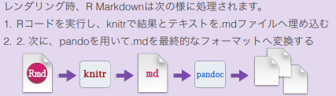

[R Markdownチートシート](https://www.rstudio.com/wp-content/uploads/2016/11/Rmarkdown-cheatsheet-2.0_ja.pdf)より

---

### ドキュメント一覧

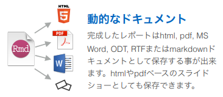

[R Markdownチートシート](https://www.rstudio.com/wp-content/uploads/2016/11/Rmarkdown-cheatsheet-2.0_ja.pdf)より

---

### もしかして、某社Office製品、いらない...？

- データ整形にExcelはいらない（Rがある）

- データ可視化にExcelはいらない（Rがある）

- データ分析にExcelはいらない（Rがある。ただし**HAD**は除く）

- レポーティングやプレゼンテーションに、WordやPowerPointはいらない<br>（htmlやpdfで問題ない）
    + やむなく必要に迫られた際は、WordやPowerPointでレンダリング可能

.footnote[.small[いや、Office便利ですよね、僕も好きですよ]]
---

## PDF化する際の注意点

.small[PDF化したい場合は、TeX環境が必要（日本語を含む場合は、特に面倒）]

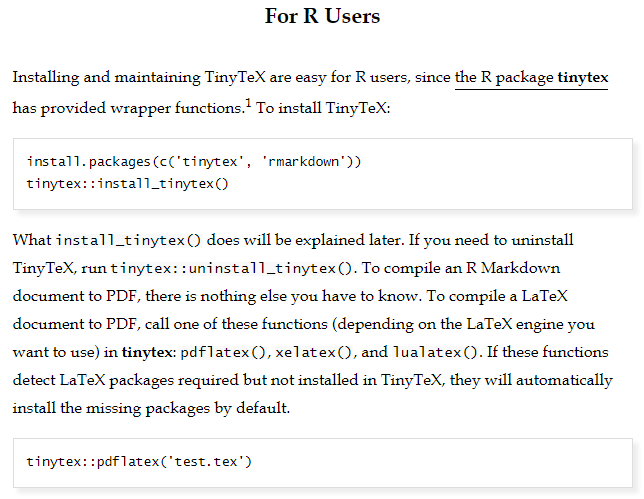
.small[そんなときは`tinytex`]

.small[参考：[TinyTeXを使って10分で(R向けの)LaTeX環境を整える](https://qiita.com/nozma/items/1c6b000b674225fd40d7)]

---

## プレゼンテーション用ドキュメント

デフォルトで以下の形式が用意されている

- ioslides: ブラウザで閲覧可能なHTML形式
- Slidy: ブラウザで閲覧可能なHTML形式
- Beamer: PDF形式（TeXによる）
- Microsoft PowerPoint

***************

その他、[xaringanパッケージ](https://github.com/yihui/xaringan)により、拡張性の高いプレゼンテーション用<br>ドキュメント作成も可能

本資料も<u>`xaringan`</u>で作成

---

class: inverse, middle, center

# R Markdownによる<br>レポーティングの利点

---

- ヒューマンエラーや手間の低減

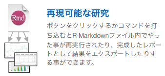
[R Markdownチートシート](https://www.rstudio.com/wp-content/uploads/2016/11/Rmarkdown-cheatsheet-2.0_ja.pdf)より

  
- `Shiny`等との連携によるインタラクティブなレポーティング

- Gitによるバージョン管理やGitHubによる共同作業との相性

- 「ドキュメント構造」の意識による、思考の整理.very_small[（個人的意見）]

---

## R Markdownが<u>ないとき</u>


数値や図表を**手作業で**レポートへ反映させる

→　入力ミス、違う図表の挿入など、**追跡困難なヒューマンエラー**の恐れ

---

.large[写し間違えたらどうする！]

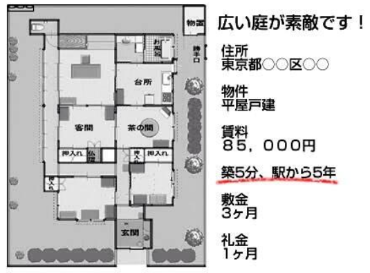


---

## R Markdownが<u>あるとき</u>

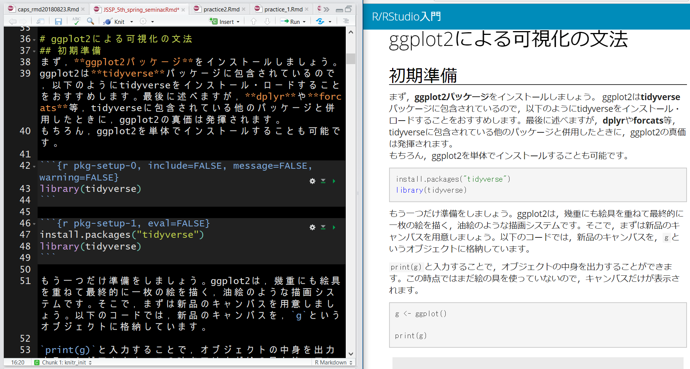
.very_small[[日本社会心理学会第5回春の方法論セミナー](https://kazutan.github.io/JSSP2018_spring/)]

- .Rmdファイルに記述した内容が**自動的に**レポートになる
- 適切にバージョン管理していれば、ミスがあっても、特定・修正できる

---

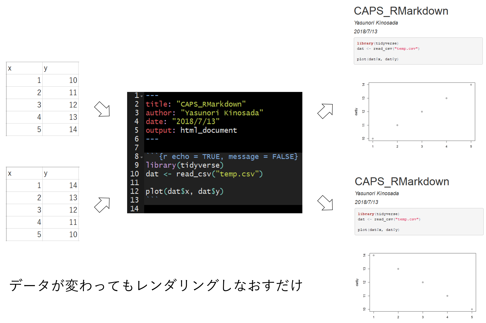

[参考映像：a reproducible workflow](https://youtu.be/s3JldKoA0zw)

---

## `Shiny`による、インタラクティブな<br>レポーティング

<!-- 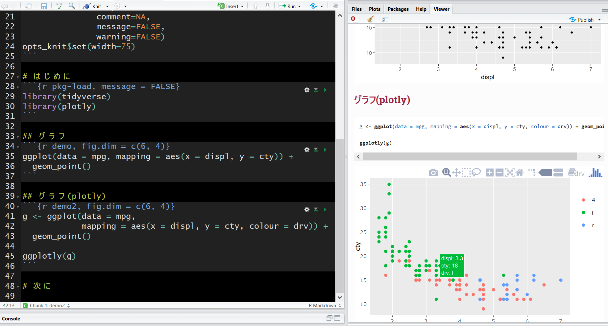 -->

```{r, message = FALSE, echo = TRUE, out.width = 450, out.height = 250}
library(tidyverse)
library(plotly)

g = ggplot(data = mtcars, mapping = aes(x = factor(am), y = wt, colour = factor(am))) +
  geom_boxplot(alpha = 0.4)

ggplotly(g)
```

---

class: inverse, middle, center

# 3. R Markdownによる<br>レポーティングの手続き

---

とりあえずチートシートを手元に置きましょう

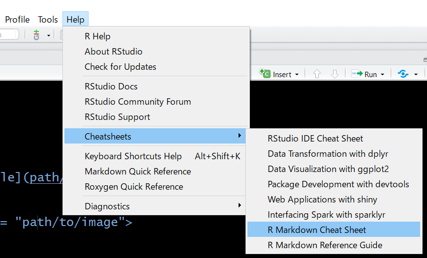

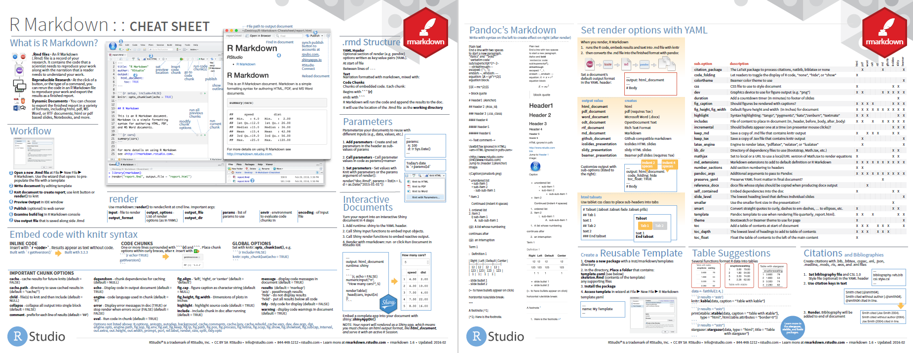


---

## 準備

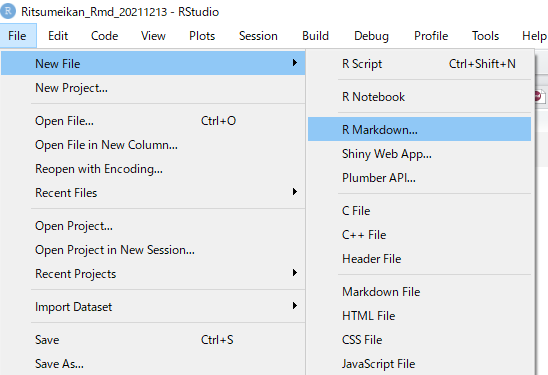


新規.Rmdファイルを用意し、ドキュメントの出力形式を選ぶ（後で変更可）

---

個人的なおすすめは、`rmdformats`パッケージをインストールし、<br>テンプレートを利用すること

特に**readthedown**や**robobook**テンプレートが便利。

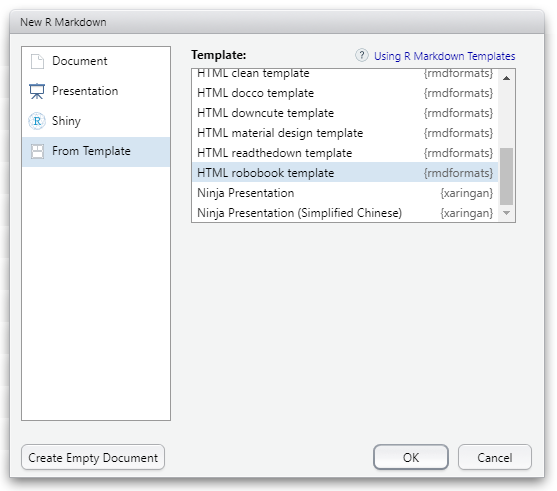

---

論文も書けちゃう

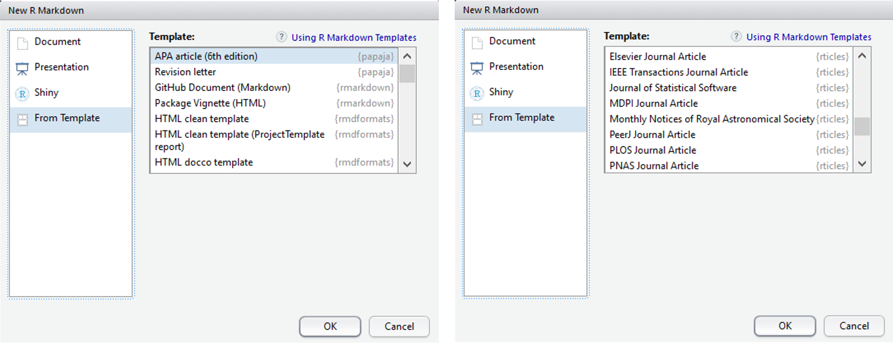
.small[
- `{papaja}`パッケージ
    + APAスタイルに特化したテンプレート
- `{rticles}`パッケージ
    + **Elsevier**, **Springer**, **PNAS**など、主要な出版社・雑誌に対応
]

.very_small[詳しくは、[アカデミアのためのRSTUDIO](https://ytake2.github.io/create.manuscript/RStudio_for_Academia.html)を参照]

---

例えば**Springer**スタイルの場合（`rticles`パッケージ）<br>.small[（別に`.tex`ファイルが作成されている）]

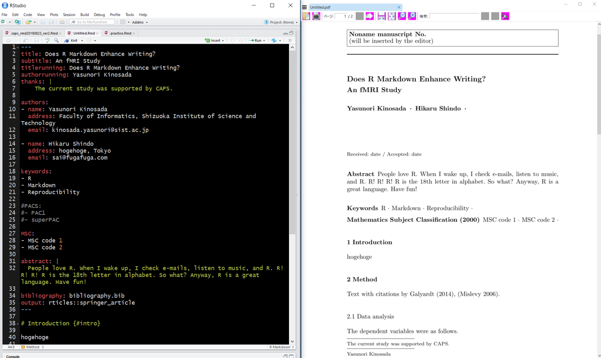

---

readthedownテンプレートの場合（`rmdformats`パッケージ）

.small[HTMLフォーマット]

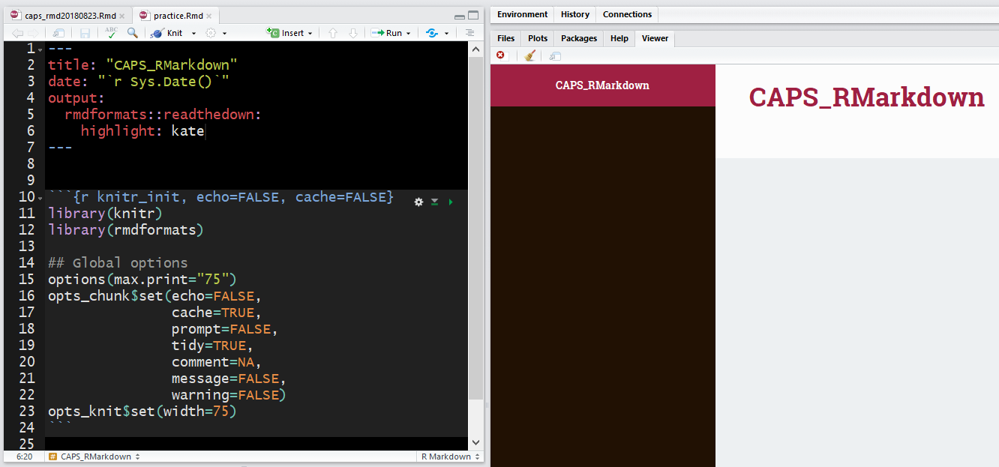

---

## フロントマター（YAMLヘッド項目）

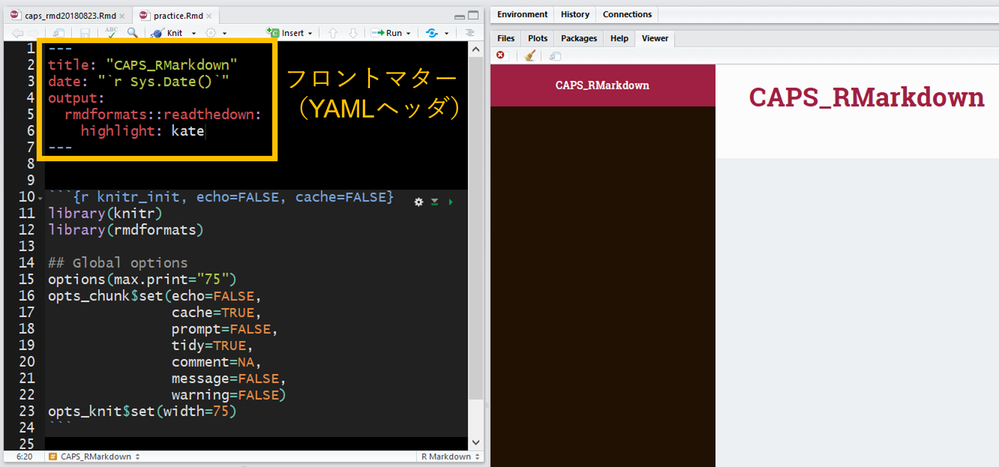

フロントマターに、ドキュメントのプロパティ情報や<br>.small[（例：日付、製作者）]、出力形式の設定を書く

---

### 個人的によく使うYAMLヘッダ項目

```yaml
---
title: "立命館大学「データサイエンス特別講義」"
subtitle: "第1部：RとR Markdownの基礎"
author: "Yasunori Kinosada"
date: "`r Sys.Date()`" #自動で本日の日付を取得するなら、`r "\u0060r Sys.Date()\u0060"`
output:
  rmdformats::readthedown:
    highlight: zenburn #コードシンタックスのハイライト方法
    md_extensions: -ascii_identifiers #マルチバイト文字を含むドキュメントで目次（TOC）を用いる際のおまじない
    self_contained: true #jsやcss，画像データなどをhtmlファイルに埋め込む
    lightbox: true #画像をクリックしたらポップアウトさせる
    toc: true #メニュー（toc: table of contents）を設ける
    toc_float: true #tocを設けた場合に、ページ冒頭ではなく、サイドメニュー化
    toc_depth: 3 #tocに反映させる見出しの階層数
---
```

.small[注意：上記はreadthedownテンプレートを適用したドキュメントの場合なので、<br>プレーンテンプレートなら`rmdformats::readthedown:`の部分を`html_document:`にすればよい]

---
### YAMLヘッダ項目一覧

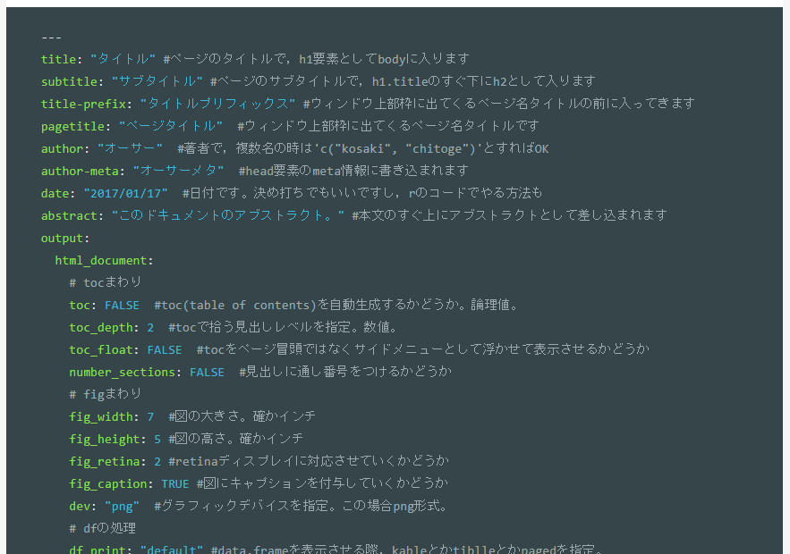

多すぎるので全容は@kazutanの記事を参照<br>
.very_small[[R Markdownのhtml_documentで指定できるyamlヘッダ項目について](https://qiita.com/kazutan/items/726e03dfcef1615ae999)]

---

## PandocのMarkdown記法で地の文を書く

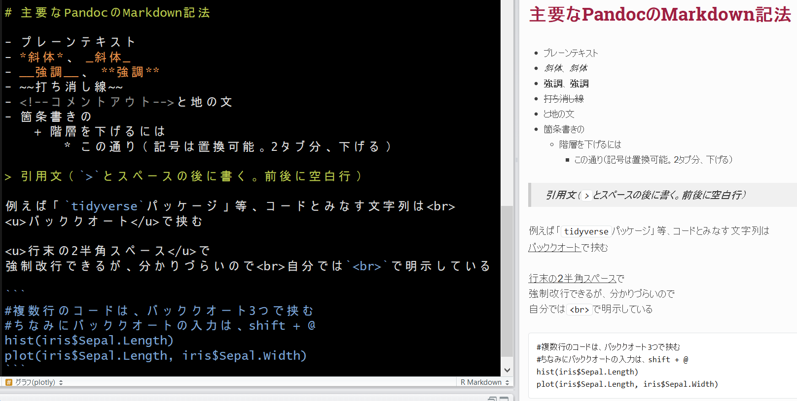

---

## Visual Editorで編集も可能

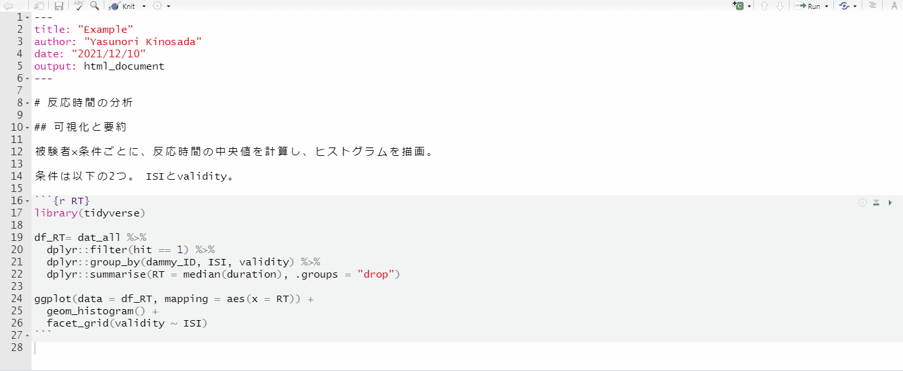

---

## コードチャンク

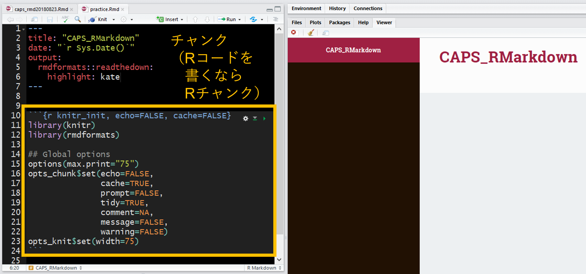

地の文ではない<u>コード部分</u>は、まとまり単位で**チャンク**の<br>中に書き、**チャンクオプション**を併用することで、挙動を操作

---

### 新しいチャンクの準備

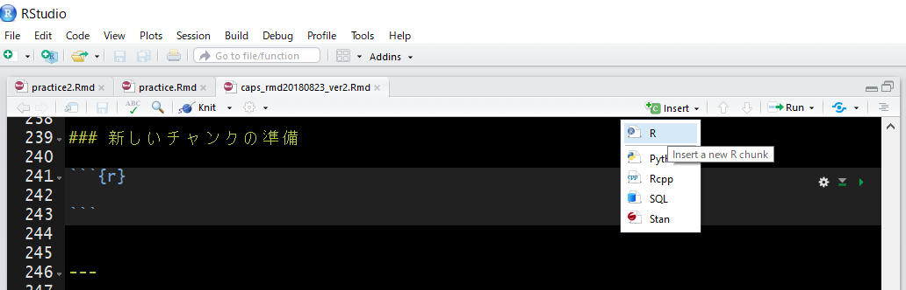

書きたい言語と対応するチャンクを選ぶ

.small[→　チャンク冒頭に、各言語の名前が必要（**Rチャンク**なら`{r}`）]

.small[※Pythonを書く場合は`reticulate`パッケージのインストールが必要]

---

### `{knitr}`パッケージがサポートしている<br>言語エンジン一覧

```{r lang-engine, echo = TRUE, out.width = 500}
names(knitr::knit_engines$get())
```

---

### チャンク生成のショートカット
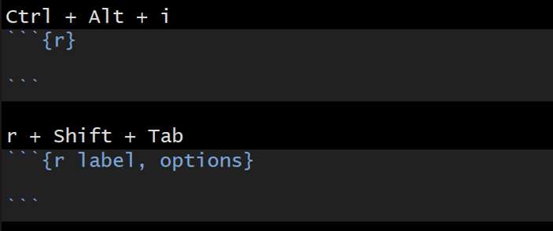

---

.small[{r チャンクラベル（省略可だが付けたほうがいい）, チャンクオプション1, チャンクオプション2, ...}]

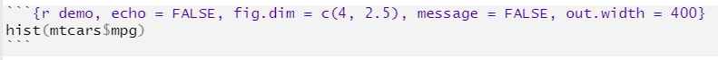

```{r demo, echo = FALSE, fig.dim = c(4, 2.5), message = FALSE, out.width = 400}
hist(mtcars$mpg)
```

- .small[なおチャンクラベルには、**アルファベット**、**数字**、**ダッシュ**`-`のみ使用推奨]<br>
- .small[同一.Rmdファイル内で、同じチャンクラベルは使用不可]

---

### チャンクオプション一覧

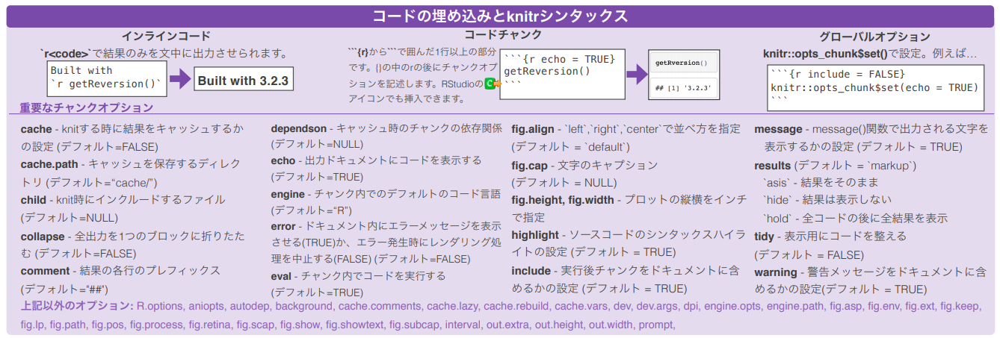

[R Markdownチートシート](https://www.rstudio.com/wp-content/uploads/2016/11/Rmarkdown-cheatsheet-2.0_ja.pdf)より

---

各チャンクで指定するのが面倒なら、グローバルな設定も可<br>　↓　使用例

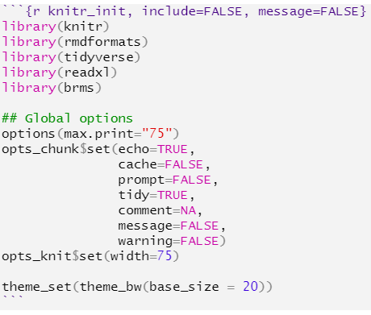

---

### GUIでチャンクオプションを設定可能
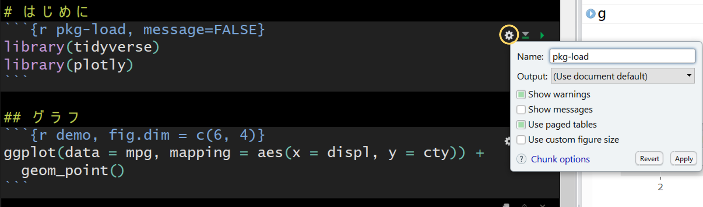

**? Chunk options**を押すと、Webページが開いて詳細を確認可

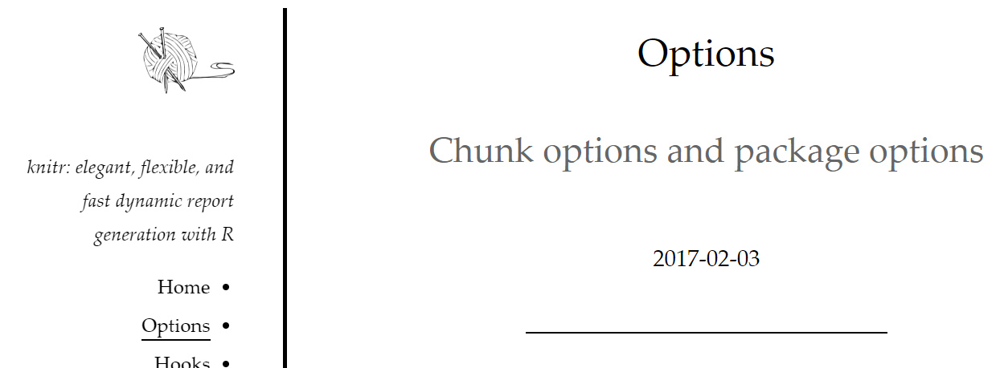

---

### チャンク単位で実行可能
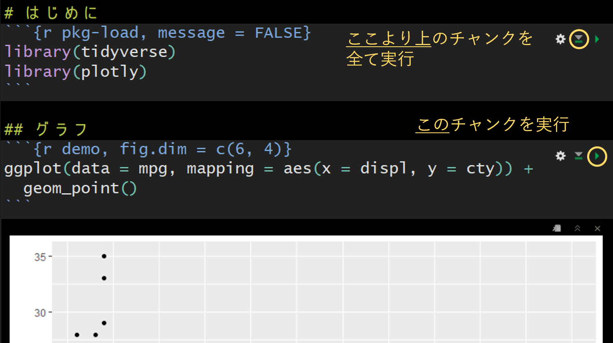

---

実行時やレンダリング時の設定は変更可能

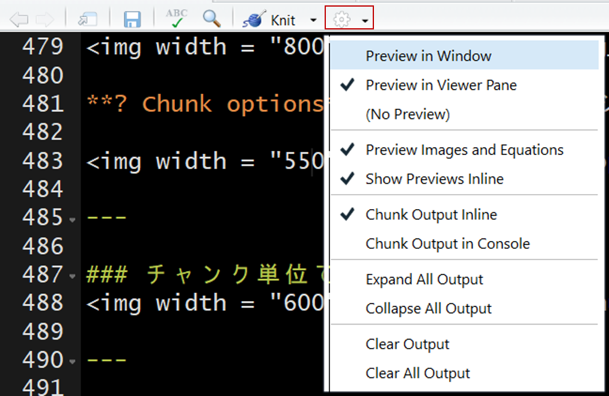

---

## 見出し

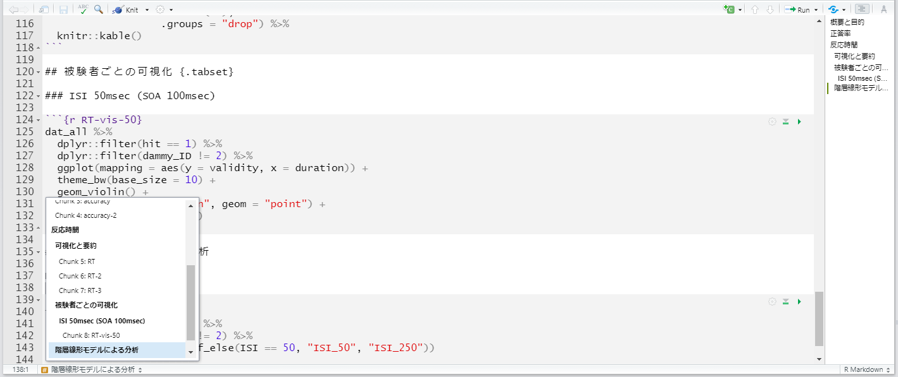

見出し（`#`の数で階層化可能）やチャンク名を付けると、<br>メニューが生成される

---

## 画像の挿入

Rコード.small[（`ggplot2`パッケージ等）]で画像を生成するのではなく、<br><u>既存の画像を挿入する</u>場合

- 方法1：Markdown記法

```r

```
```r
![alt text or image title][hogehoge]
[hogehoge]: path/to/image
```
```r

```

Markdown記法なので、文章扱い。コードチャンク**外**に書く

---

- 方法2：`knitr`パッケージの`include_graphics()`

Rコードなので、コードチャンク**内**に書く

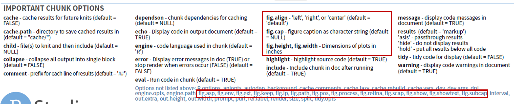

画像のプロパティを、チャンクオプションで様々に操作可

---

## 表の生成

- 方法1：`knitr::kable()`（とりあえずこれでいい）

```{r table-demo}
knitr::kable(x = head(mtcars, 2),
             format = "html",
             digits = 2,
             align = "c",
             caption = "two rows of mtcars dataset")
```
---

- 方法2：自力で書く
    + `knitr::kable()`を、Markdown形式で出力させると...

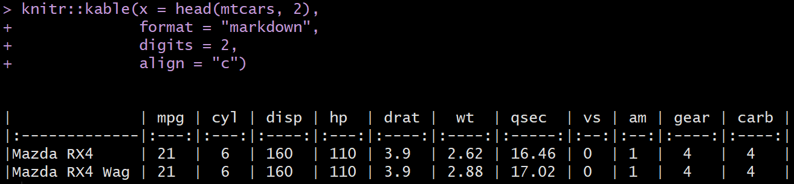

実はこれが、表のMarkdown記法

- `:-----`　　左揃え
- `:----:`　　中央揃え
- `-----:`　　右揃え

---

## Data.frameの表示

行数が少なければ`knitr::kable()`でよいが、多いと場所をとる

→　フロントマターで、`df_print`を`"paged"`に変更

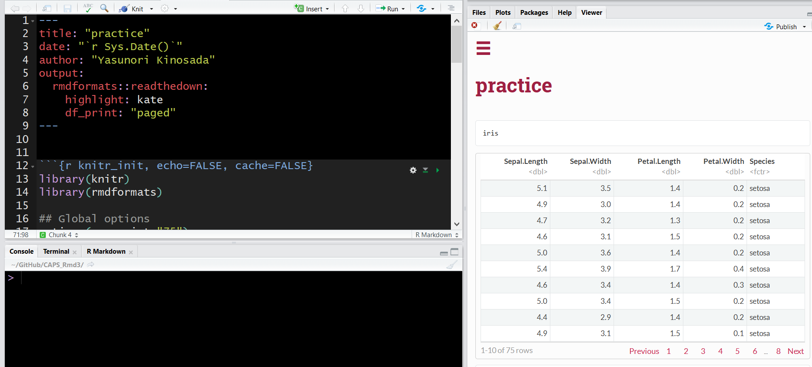

---

### 行が多すぎて省略される場合でも...

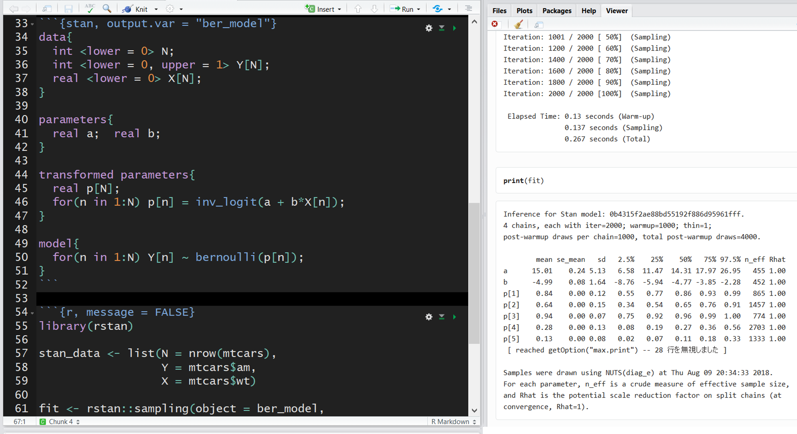

---

クラスを`data.frame`にしてしまえば、<br>`df_print: "paged"`で全行表示可

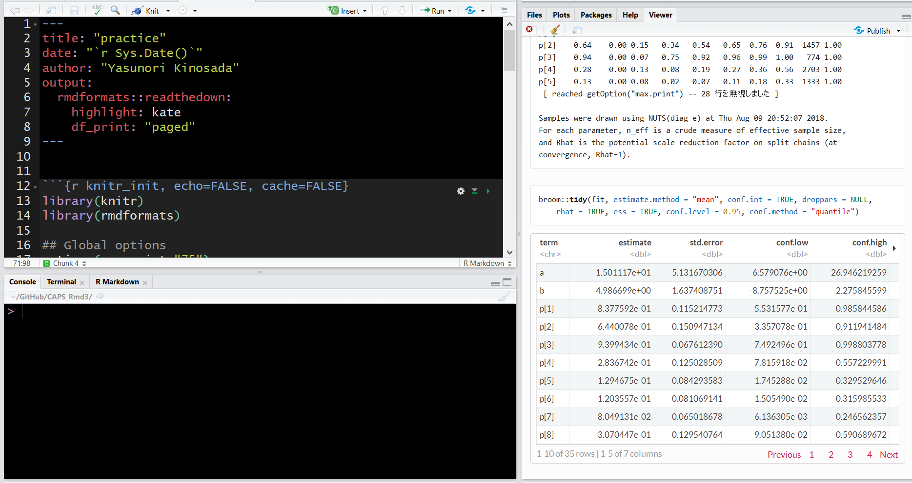

.small[※`broom::tidy()`は出力を`data.frame`にする関数]

---

## インラインコード・数式の表示

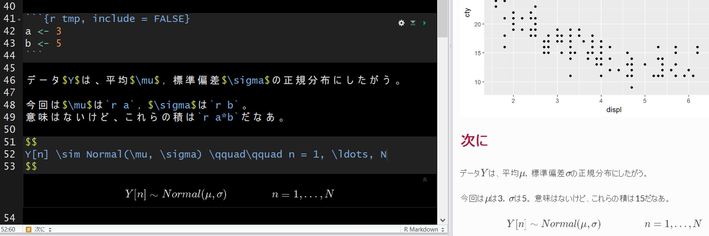

値を**書き写す**手間・必要が一切不要

TeXと同じ記法で数式を書ける

---

## 書きあがったらKnit（レンダリング）

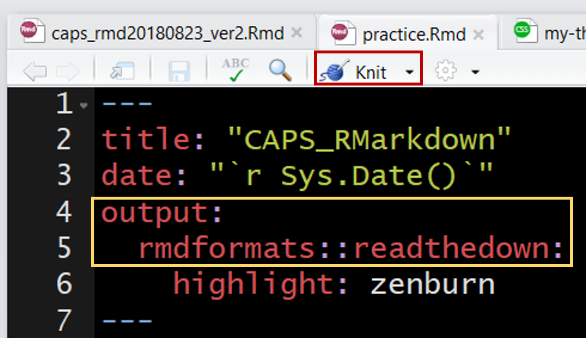

outputのフォーマットに応じて出力される

---

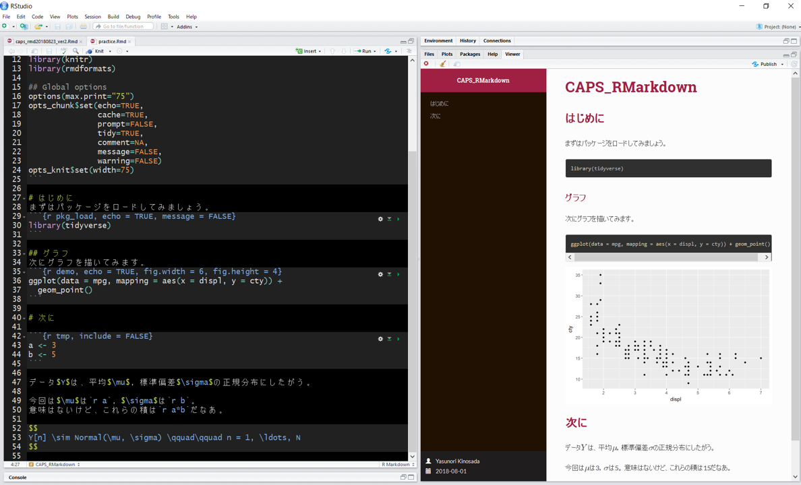

どんっ！

---

class: inverse, middle, center

実習①：[このHTMLドキュメント](https://kinosady86.github.io/20211213_ritsumeikan_rmd/practice.html)と同じものを作ってみよう。

実習②：好きなデータセットを用いて、HTMLドキュメントを書いてみよう

---

# 実習②におけるデータセットの選択

1. 自分が持っている実験／調査データ

2. Rパッケージが持っているサンプルデータ
    + 例：`datasets::mtcars`、`ggplot2::diamonds`

********************

※ 後で、Web上にドキュメントを公開する実習を行うので、問題のないデータセットにしてください