```{r setup, include=FALSE}
options(htmltools.dir.version = FALSE)
knitr::opts_chunk$set(
  fig.width=9, fig.height=3.5, fig.retina=3,
  out.width = "100%",
  cache = FALSE,
  echo = TRUE,
  message = FALSE, 
  warning = FALSE,
  hiline = TRUE
)
```

```{r xaringan-themer, include=FALSE, warning=FALSE}
library(xaringanthemer)

extra_css = list(
  ".red" = list(color = "red"),
  ".orange" = list(color = "orange"),
  ".chocolate" = list(color = "chocolate"),
  ".too_large" = list("font-size" = "200%"),
  ".very_large" = list("font-size" = "150%"),
  ".large" = list("font-size" = "120%"),
  ".small" = list("font-size" = "80%"),
  ".very_small" = list("font-size" = "65%"),
  ".too_small" = list("font-size" = "50%"),
  ".full-width" = list(
    display = "flex",
    width = "100%",
    flex = "1 1 auto"
  )
)

style_mono_accent(
  link_color = "chocolate",
  extra_css = extra_css,
  base_color = "#1c5253", # 全体的な配色（今回は緑ベース）
  text_font_size = "30px" # スライド本文のフォントサイズ（スライドタイトルは別）
)

```


### ドキュメントを公開したい（HTMLドキュメントを想定）

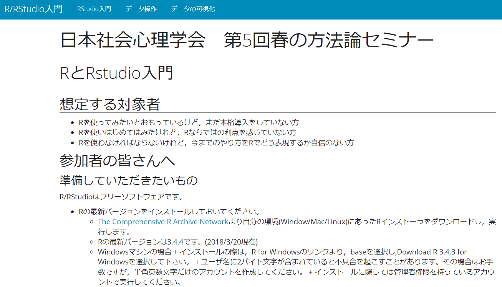

[日本社会心理学会　第5回春の方法論セミナー](https://kazutan.github.io/JSSP2018_spring/)

---

### ドキュメントを公開したい（HTMLドキュメントを想定）

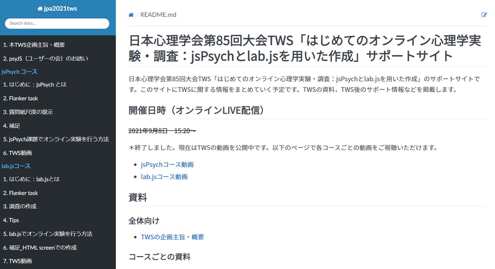

[日本心理学会　第85回大会TWS](https://mklab-japan.github.io/jpa2021tws/)

---

えっ...技術資料ならともかく、<br>研究内容に関する資料（例：分析結果をまとめたドキュメント）を<br>インターネット上に公開することなんてある？

研究内容が流出するだけじゃん...

って思うかもしれないが、.too_large[ある]。

---

## 論文（など）のsupplementary materials

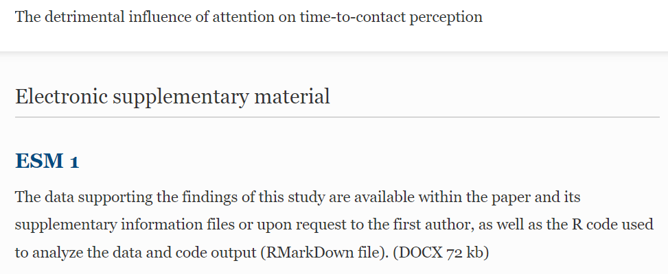

.small[The detrimental influence of attention on time-to-contact perception<br>(Baurès et al., 2018 | AP&P)]

---

## Open Science

.pull-left[
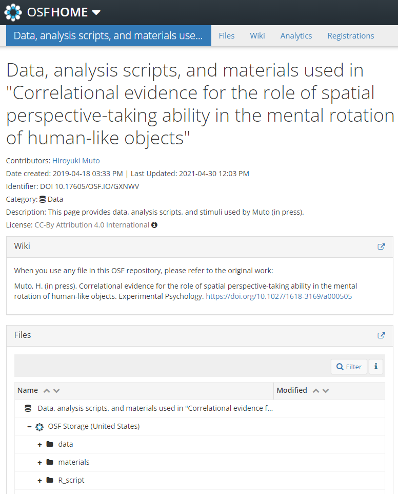
]

.pull-right[
Muto (inpress | Experimental Psycohlogy)の論文で使用した<br>刺激やデータ、分析スクリプト

[リンクはこちら](https://osf.io/gxnwv/)
]

---

1つ前のスライドのように、データや解析プログラム、レンダリングしたHTMLドキュメント自体を、何らかのサーバにアップロードしても良い。

例えば[Open Science Framework（OSF）](https://osf.io/)は、デファクトスタンダードの1つ。

OSFは、Center for Open Scienceが管理する、<u>GitHubリポジトリ</u>。

　→　この講義では、**GitHub上でHTMLドキュメントを公開する方法**を解説

---

class: inverse, middle, center

# GitHubによるドキュメント共有

---

# そもそも、Gitというバージョン管理システムがある

R Markdownを使いさえすれば、ヒューマンエラーが解消される...<u>わけではない</u>

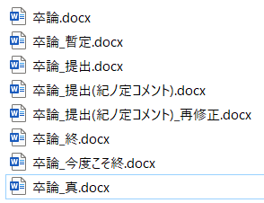
どれがどう違うの...？

---

Gitによるバージョン管理の利点（更新の差分が分かる）

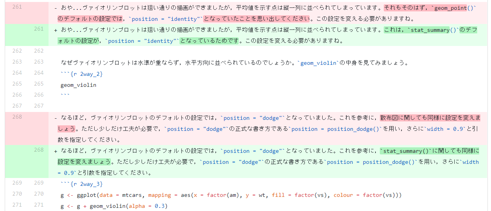

---

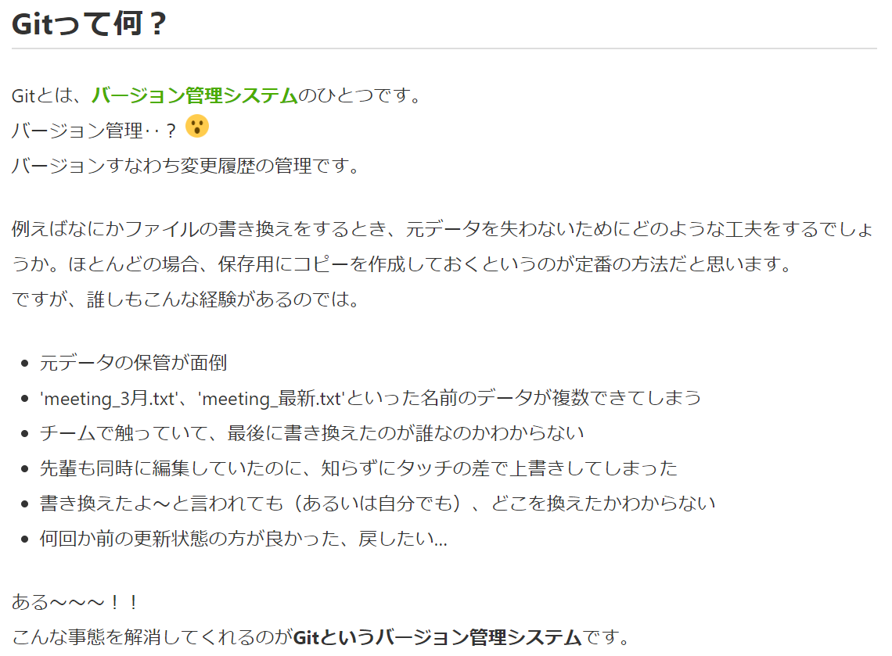

.small[[【初心者向け】Gitってなに？①まず流れを理解する（コードなし）](https://qiita.com/nutsinshell/items/96cb83aecf9d09a7a8bc)]
---

# 参考資料①

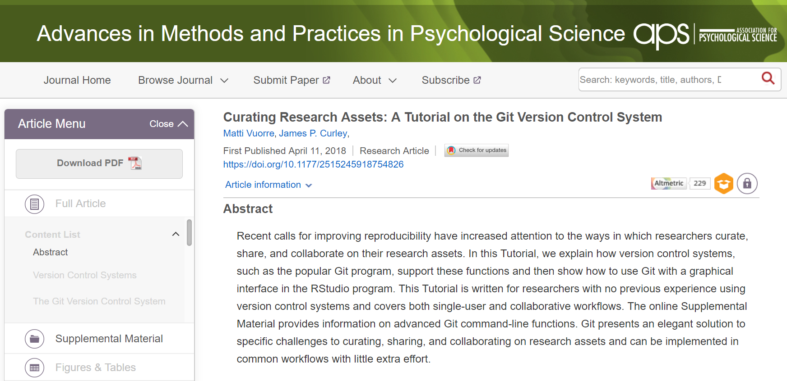

[リンク](http://journals.sagepub.com/doi/abs/10.1177/2515245918754826)

---

# 参考資料②

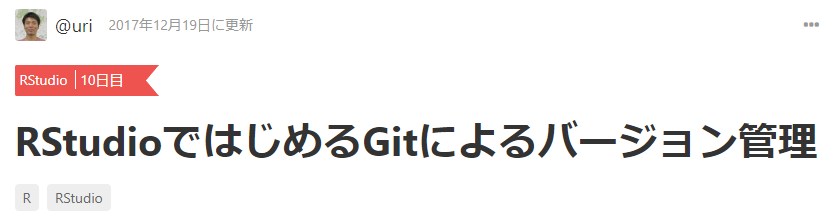

[リンク](https://qiita.com/uri/items/6b94609f156173ed43ed)

---

この講義の主眼は**バージョン管理方法ではない**ので、説明を省略します。

知りたい方は、以下の資料をご参照ください（初心者向け）。

[R Markdownによるドキュメント生成とバージョン管理入門](https://www.slideshare.net/nocchi_airport/r-markdown-111322653)

---

**Git**と**GitHub**は別物なので注意

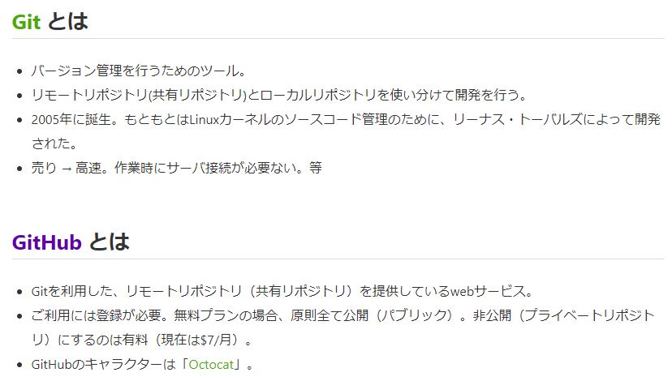
<br>[GitHub入門](https://qiita.com/ay3/items/8d758ebde41d256a32dc)

---

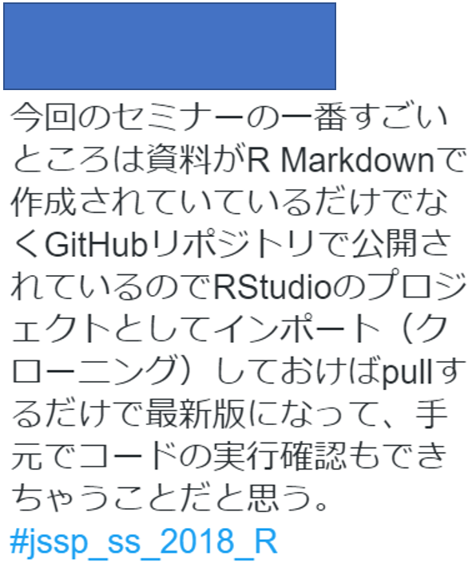

.very_small[日本社会心理学会　第５回春の方法論セミナー「R/RStudio入門」　参加者の感想]

---

# まずはGitHubアカウントを取得する

以下のサイトの手順に従って実施してください。

[GitHubアカウントの作成方法 (2021年版)](https://qiita.com/ayatokura/items/9eabb7ae20752e6dc79d)

**注意**

- 大学のメールアドレス（~ @ hogehoge.ac.jp）で登録
- 本格的に使いたい人は、後日改めて**GitHub Education**に申請すると、利用できる機能が増える
  + [GitHub Educationの申請方法](https://qiita.com/mtfum/items/d8c06c9a28ce04d3043a)

---

# GitHub Pagesの機能で、HTMLドキュメントを公開する

このサイトの説明が分かりやすいです。この通りにやりましょう。

[【超簡単】GitHub Pagesとは？手軽にサイト公開してみよう！](https://crestadesign.org/git-githubpages/)

---

class: inverse, middle, center

# Enjoy!

ご質問等があれば、遠慮なくご連絡ください